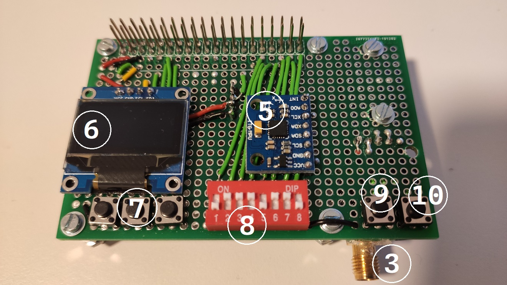
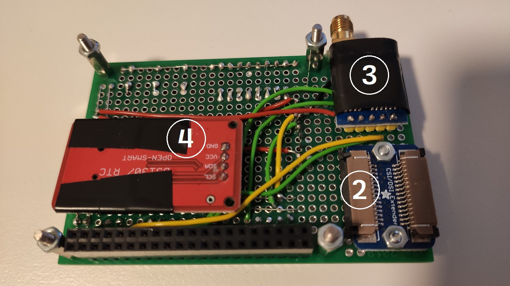

# Calchas

> "Why, what is a seer? A man who with luck tells the truth sometimes, with frequent falsehoods, but when his luck deserts him, collapses then and there." - Iphigenia in Aulis 955

Calchas is a project for automotive driving data collection. The hardware consists of a few sensors on a custom board mounted to a Raspberry Pi. The data collection is driven by `calchas-recorder.py` program, stored on the SD card, and controlled through buttons and dip switches. The `calchas-analyzer` can import recordings from the Raspberry Pi to the desktop and run analysis on the data.

## Components

Each sensor collects timestamped data. The system clock is synchronized to the RTC during boot time. This guarantees that the timestamp each sensor generates is consistent.

| # | Component | Comment                 | Connection     | `/boot/config.txt`            |
|--------|-----------|-------------------------|----------------|-------------------------------|
| 1 | Raspberry Pi Camera   | Camera v1, 5MP                   | MIPI CSI-2 | `gpu_mem=128` and `disable_camera_led=1` |
| 2 | Adafruit CSI Cable Extender | Makes swapping the camera easier | MIPI CSI-2 |  |
| 3 | NEO-7M Mini GPS       | With external antenna | UART (GPIO PIN 14, 15) |  |
| 4 | DS1307 RTC        | Consistent timestamps without NTP sync or after power cut | I2C (GPIO PIN 2, 3) | `dtoverlay=i2c-rtc,ds1307` |
| 5 | GY-521 MPU6050        | 3-Axis Acceleration Gyroscope 6DOF; AD0 PIN set to high changes default address 0x68 to 0x69 | I2C (GPIO PIN 2, 3) 0x69 |  |
| 6 | SDD1306 OLED          | 0.96" 128x64 Monochrome   | I2C (GPIO PIN 2, 3) 0x3c | `dtparam=i2c_arm=on,i2c_arm_baudrate=400000` |
| 7 | OLED Menu | Switch to previous (left) / next (right) menu screen and toggle screen mode (middle) | GPIO PIN 17, 27, 18 |  |
| 8 | Dip Switches | 8 switches to control the program | GPIO PIN 6, 12, 13, 16, 19, 20, 21, 26 |  |
| 9 | Stop Recording | Hold 2sec to stop recording | GPIO PIN 25 |  |
| 10 | Shutdown Button | Shut down the Raspberry Pi gracefully | GPIO PIN 5 | `dtoverlay=gpio-shutdown,gpio_pin=5` |

### Dip Switches

| #       | Activate               | PIN     | Comment                       |
|---------|------------------------|---------|-------------------------------|
| 1       | Start recorder on boot | GPIO 12 |                               |
| 2       | Display                | GPIO 6  |                               |
| 3       | SystemInfo             | GPIO 13 | Default 2Hz                   |
| 4       | PiCamera               | GPIO 19 | Default 1920x1080 @10fps      |
| 5       | Webcam                 | GPIO 16 | Default 1280x720 @10fps; USB Webcam through OpenCV     |
| 6       | IMU                    | GPIO 20 | Default 5Hz                   |
| 7       | GPS                    | GPIO 26 | Default ~5Hz (unreliable)     |
| 8       | unused                 | GPIO 21 |                               |

## Recording

### SYSTEMINFO

systeminfo.csv: `timestamp,system_cpu_percent,system_cpu_times_percent_system,system_cpu_times_percent_user,system_cpu_times_percent_idle,system_cpu_temp,system_loadavg_1,system_loadavg_5,system_loadavg_15,system_virtual_memory_percent,process_cpu_percent,process_cpu_time_system,process_cpu_time_user,process_mem_rss_percent,process_mem_vms_percent,disk_percent`

### PICAM

picam.csv: `timestamp,frame_num,frame_type,frame_size,video_size`

picam.h264: Raw H264 stream

### WEBCAM

webcam0.csv: `timestamp,frame_num,frame_size`

webcam0.avi: MJPG format

### IMU

imu.csv: `timestamp,gyro_x,gyro_y,gyro_z,acc_x,acc_y,acc_z,rot_x,rot_y`

### GPS

gps.csv: `timestamp,longitude,latitude,altitude`

## Analysis

TODO
